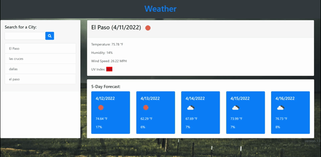

# HW-06-Weather

fixed HTML filename
added HTML, CSS, some JS
added bootstrap, jquery, momentjs
API key obtained and added to variable

background image added

changed ' to ` for URLs

js complete
local storage working
search function working

WORKS WHEN OPEN ON BROWSER BUT NOT ON GITHUB PAGES. Unsure why!

Link-https://jacef790.github.io/HW-06-Weather/

